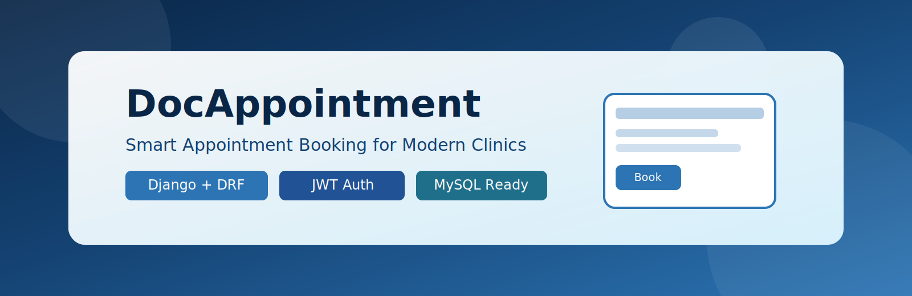
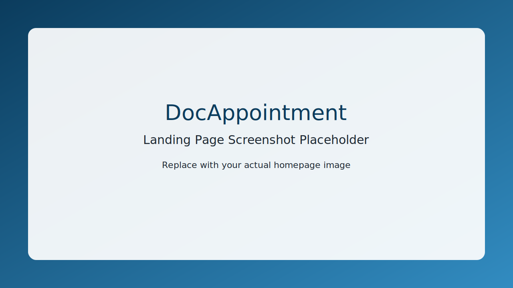
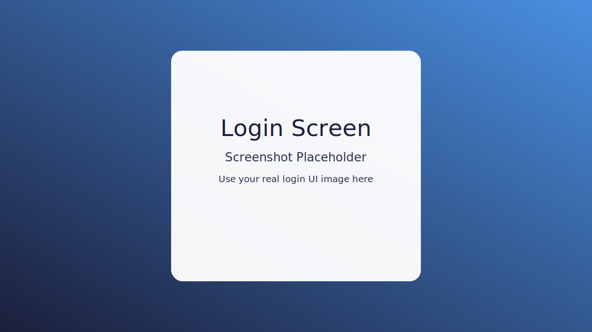
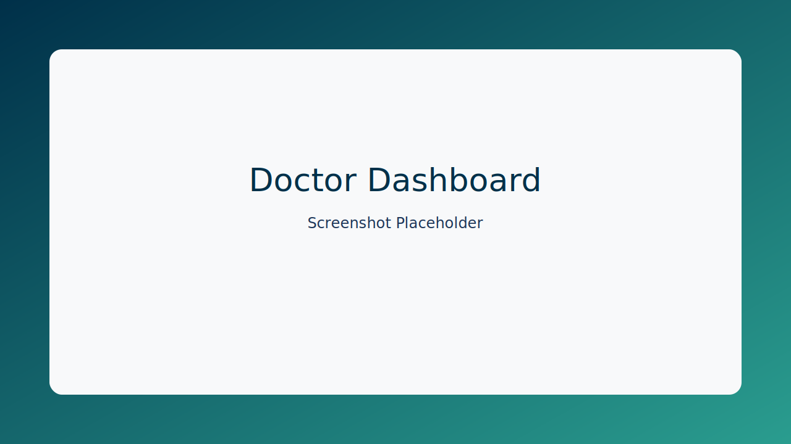
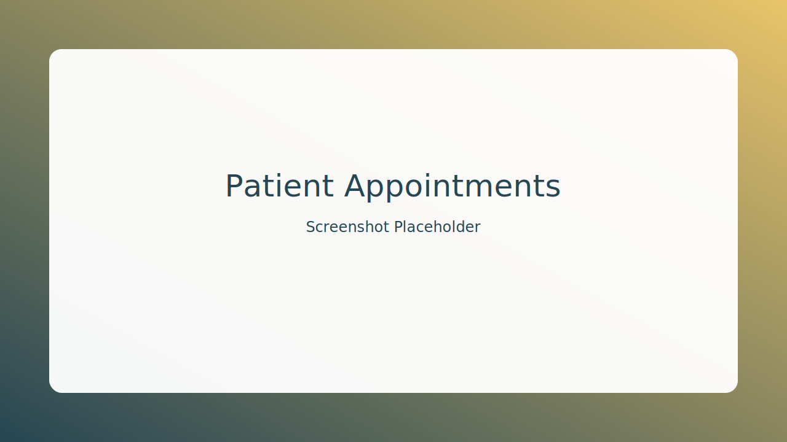
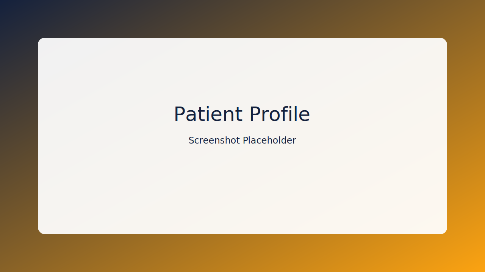
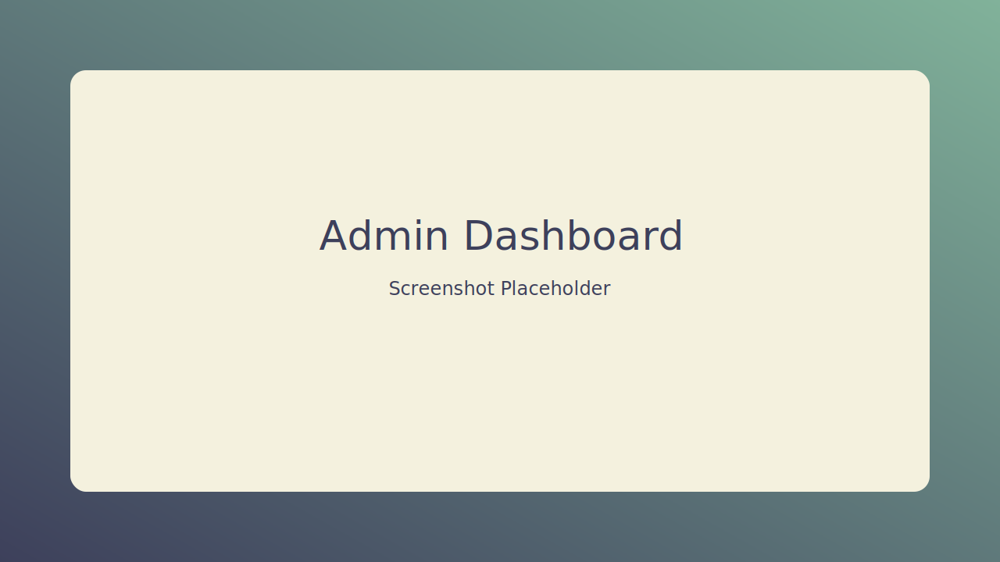

<p align="center">
	
</p>

<h1 align="center">DocAppointment</h1>

<p align="center">
	Smart doctor appointment booking platform built with Django REST API and a clean multi-role frontend.
</p>

<p align="center">
	
	
	
</p>

<p align="center">
	<a href="https://www.djangoproject.com/"></a>
	<a href="https://www.django-rest-framework.org/"></a>
	<a href="https://www.mysql.com/"></a>
	<a href="https://jwt.io/"></a>
</p>

<p align="center">
	<a href="http://127.0.0.1:8000/api/"></a>
	<a href="https://github.com/vishnunishad/DocAppointment#demo"></a>
	<a href="https://github.com/vishnunishad/DocAppointment/issues"></a>
</p>

## Table of Contents

- [Overview](#overview)
- [Highlights](#highlights)
- [Screenshots](#screenshots)
- [Demo](#demo)
- [Project Architecture](#project-architecture)
- [Tech Stack](#tech-stack)
- [Quick Start](#quick-start)
- [API Quick Reference](#api-quick-reference)
- [Frontend](#frontend)
- [Environment Variables](#environment-variables)
- [Deployment](#deployment)
- [Security Notes](#security-notes)
- [Roadmap](#roadmap)
- [Contributing](#contributing)
- [License](#license)

## Overview

DocAppointment helps patients find doctors, manage profiles, and book appointments while giving doctors and admins dedicated dashboards for operational tasks.

## Highlights

- Secure login and registration with JWT authentication
- Role-based dashboards for admin, doctor, and patient
- Doctor listing and detailed profile pages
- Patient profile and appointment management views
- OTP/email based password reset flow
- Clean separation between Django API backend and static frontend

## Screenshots

> Replace these image paths with your real screenshots to make the repo visually strong.

| Landing Page | Login | Doctor Dashboard |
|---|---|---|
|  |  |  |

| Patient Appointments | Patient Profile | Admin Dashboard |
|---|---|---|
|  |  |  |

## Demo

Add your walkthrough video link here:

- YouTube: `https://github.com/vishnunishad/DocAppointment#demo`
- Loom: `https://github.com/vishnunishad/DocAppointment#demo`

If you prefer, you can also embed a short GIF preview:

```md

```

## Project Architecture

```text
DocApp/
|-- medicare_backend/       Django project and REST APIs
|   |-- accounts/           Authentication, users, profiles
|   |-- api/                Core API endpoints and business logic
|   |-- config/             Django settings and URL configuration
|-- templates/              Frontend HTML pages
|-- static/                 CSS and JavaScript assets
|-- media/                  Uploaded profile images
```

## Tech Stack

- Backend: Python, Django, Django REST Framework
- Auth: SimpleJWT (JWT with cookie/session flow)
- Database: MySQL
- Frontend: HTML, CSS, JavaScript
- Utilities: python-dotenv, Pillow

## Quick Start

### 1. Move to backend directory

```bash
cd medicare_backend
```

### 2. Create and activate virtual environment

```bash
python -m venv venv
# Windows PowerShell
venv\Scripts\Activate.ps1
```

### 3. Install dependencies

```bash
pip install django djangorestframework django-cors-headers djangorestframework-simplejwt mysqlclient python-dotenv pillow
```

### 4. Configure environment variables

```bash
copy .env.example .env
```

Update values in `.env` for database, secret key, allowed hosts, and email credentials.

### 5. Run migrations

```bash
python manage.py migrate
```

### 6. Create admin user (optional)

```bash
python manage.py createsuperuser
```

### 7. Start backend server

```bash
python manage.py runserver
```

Backend URL: `http://127.0.0.1:8000/`

## API Quick Reference

Base URL: `http://127.0.0.1:8000/api/`

| Method | Endpoint | Description | Auth |
|---|---|---|---|
| POST | `/api/register/` | Register a new user | No |
| POST | `/api/auth/login/` | Login and issue JWT tokens | No |
| POST | `/api/auth/refresh/` | Refresh access token | Cookie/Refresh token |
| POST | `/api/auth/logout/` | Logout and clear auth cookies | Yes |
| POST | `/api/auth/password-reset-email/` | Send password reset OTP/email | No |
| POST | `/api/auth/password-reset-confirm/` | Confirm password reset with OTP/token | No |
| GET/PUT/PATCH | `/api/my-medical-profile/` | Get or update logged-in user profile | Yes |
| GET/PUT/PATCH | `/api/profile/` | Profile endpoint from core API app | Yes |
| GET/POST | `/api/users/` | User list/create (viewset endpoint) | Depends on permission class |
| GET/POST | `/api/appointments/` | List/create appointments | Depends on permission class |
| GET | `/api/otp/smtp-test/` | SMTP configuration test | Depends on permission class |
| POST | `/api/otp/send/` | Send OTP email | Depends on permission class |
| POST | `/api/otp/verify/` | Verify OTP code | Depends on permission class |

> Note: Viewset routes like detail/update/delete are also available (for example `/api/users/{id}/` and `/api/appointments/{id}/`).

## Frontend

Run frontend pages with a local static server (for example VS Code Live Server) and open:

- `templates/index.html`

Password reset frontend URL expected by backend:

- `http://127.0.0.1:5500/templates/reset-password.html`

If you change frontend host, port, or file path, update `FRONTEND_RESET_PASSWORD_URL` in `.env`.

## Environment Variables

Primary variables (see `medicare_backend/.env.example`):

- `DEBUG`
- `SECRET_KEY`
- `DB_NAME`
- `DB_USER`
- `DB_PASSWORD`
- `DB_HOST`
- `DB_PORT`
- `ALLOWED_HOSTS`
- `EMAIL_HOST_USER`
- `EMAIL_HOST_PASSWORD`
- `DEFAULT_FROM_EMAIL`
- `FRONTEND_RESET_PASSWORD_URL`

## Deployment

### Render

1. Push this project to GitHub.
2. Create a new Web Service on Render and connect your repository.
3. Set root directory to `medicare_backend`.
4. Use build command:

```bash
pip install -r requirements.txt
python manage.py migrate
```

5. Use start command:

```bash
gunicorn config.wsgi:application --bind 0.0.0.0:$PORT
```

6. Add all required environment variables from `.env.example` in Render dashboard.
7. Set `DEBUG=False` and configure `ALLOWED_HOSTS` for your Render domain.

### Railway

1. Create a new project in Railway from your GitHub repository.
2. Set service root to `medicare_backend`.
3. Configure environment variables from `.env.example`.
4. Add MySQL plugin/service and map credentials to `DB_*` variables.
5. Configure start command:

```bash
gunicorn config.wsgi:application --bind 0.0.0.0:$PORT
```

6. Run migrations after deploy from Railway shell:

```bash
python manage.py migrate
```

### AWS EC2 (Ubuntu)

1. Launch an EC2 instance and open ports `22`, `80`, and `443`.
2. Install system packages:

```bash
sudo apt update
sudo apt install -y python3-pip python3-venv nginx
```

3. Clone repository, then setup backend in `medicare_backend`:

```bash
python3 -m venv venv
source venv/bin/activate
pip install -r requirements.txt
python manage.py migrate
```

4. Create systemd service for Gunicorn and start it.
5. Configure Nginx as reverse proxy to Gunicorn socket/port.
6. Secure domain with SSL using Certbot.
7. Set `DEBUG=False`, production `ALLOWED_HOSTS`, and secure cookie settings.

## Security Notes

- Do not commit `.env` files.
- Use strong secrets and app-specific email passwords.
- Rotate credentials immediately if leaked.

## Roadmap

- Add automated tests for authentication and booking flows
- Add appointment status notifications
- Add API documentation (OpenAPI/Swagger)
- Add Docker support for easier deployment

## Contributing

Contributions are welcome. Open an issue first to discuss major changes, then submit a pull request.

## License

This project is currently intended for learning and development purposes.
